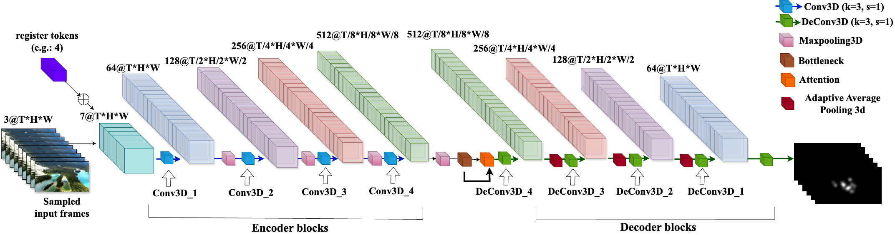

# STR-VQA: Saliency-Driven Transfer Learning with Register Tokens for Spatiotemporal Video Quality Assessment

## 📌 About
This repository contains the official implementation of **STR-VQA**, a lightweight and efficient no-reference video quality assessment (NR-VQA) model. STR-VQA introduces a register token-augmented UNet3D for generating saliency maps, which enhance spatial and temporal feature extraction for robust quality prediction.

The model achieves state-of-the-art performance on three major benchmarks:
- **KoNViD-1k**
- **LIVE-VQC**
- **YouTube-UGC**

## 🚀 Key Features
- **Register Tokens** in a 3D UNet backbone for enhanced saliency learning.
- **Saliency-weighted ResNet-50** for spatial quality feature extraction.
- **Transformer-based temporal modeling** for learning temporal dependencies.
- **Efficient pipeline** with low compute cost (59 GFLOPs for 8-frame input).

### 🎯 Saliency Prediction Module (UNet3D with Register Tokens)


### 📉 STR-VQA Quality Prediction Module (Spatial + Temporal Fusion)


## 🧱 Project Structure
- `sal_withreg.py / sal_noreg.py` – Saliency model architecture with and without registers.
- `train_sal_withreg.py / train_sal_noreg.py` – Training script for saliency map generation with and without registers.
- `inference.py` – Saliency inference using pre-trained UNet with register tokens.
- `dataloader.py` – Dataset loading for KoNViD-1k, LIVE-VQC, and YouTube-UGC.
- `extract_frame.py` – Frame extractor utility.
- `utilities.py` – Custom loss functions and normalization utilities.
- `spatiotemp.py` – STR-VQA model definition (spatial + temporal analyzers).
- `train_vqa.py` – Distributed training for the full STR-VQA model.
- `evaluate.py` – Evaluation script for fine-tuning and metrics visualization.

## 📦 Installation
```bash
git clone https://github.com/mithila442/STR-VQA.git
cd STR-VQA

# (Optional) Create a virtual environment
python -m venv myenv
source myenv/bin/activate

# Install dependencies
pip install -r requirements.txt
```

## 📁 Dataset Preparation

- Download raw videos and MOS CSV from the official website.
- Use `extract_frame.py` to extract 8 frames per video for VQA and 60 frames for saliency.

## 🧪 Run Instructions

### Train Saliency Model from Scratch
```bash
python train_sal_withreg.py
```

### Generate Saliency Maps (Pretrained Inference)
```bash
python inference.py
```

### Train STR-VQA Model
```bash
python train_vqa.py
```

### Fine-tune & Evaluate STR-VQA
```bash
python evaluate4.py
```

## 👥 Contributors
- Mayesha Maliha R. Mithila
- Mylene C.Q. Farias

## 📬 Contact
elx12@txstate.edu
